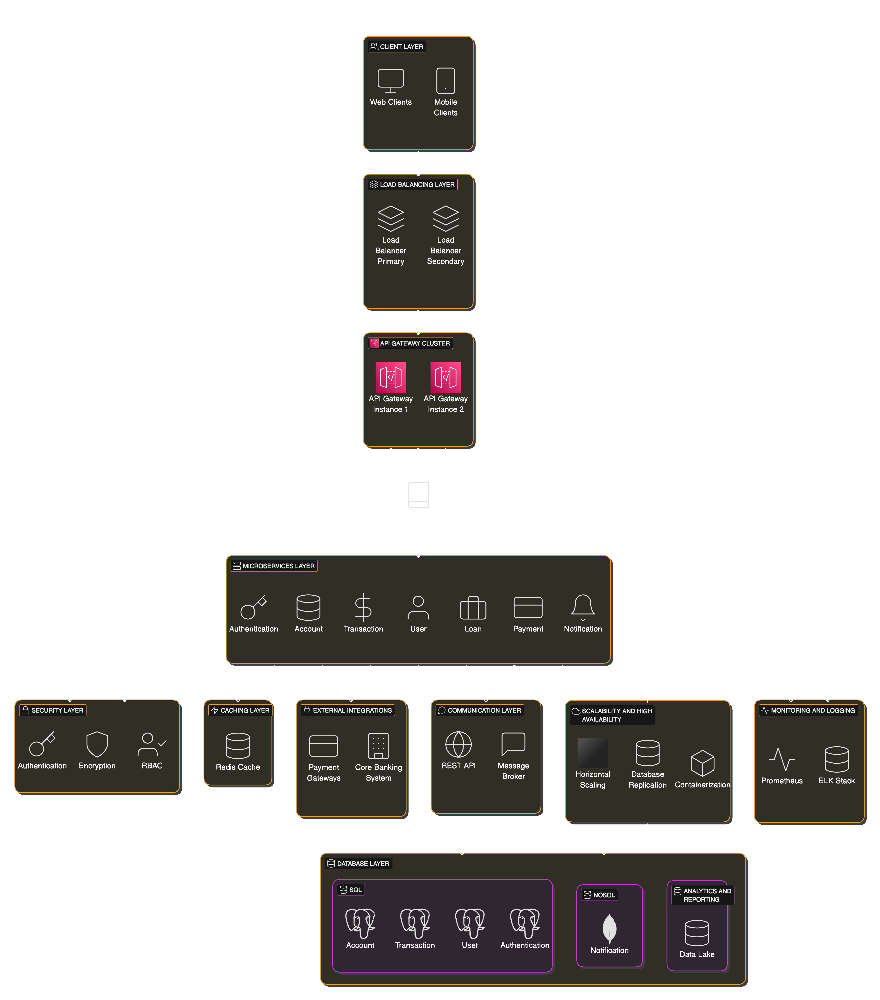

# Core Banking App System Design

## Table of Contents

- [What is Core Banking?](docs/README.core-app.md#What-is-Core-Banking?)
  - [Key Components of Core Banking](docs/README.core-app.md##Key-Components-of-Core-Banking)
- [Architecture Design Overview](docs/README.info.md#Architecture-Design-Overview)
- [Communication](docs/README.info.md#communication)
- [Key Considerations](docs/README.info.md#key-considerations)

## Example of a service implementation (Account Service)

## Asyncronous Event Flow Diagram

